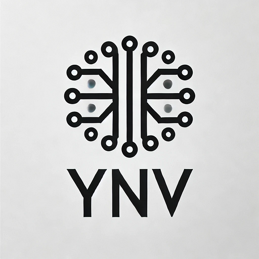

# Yantra Nirmaan Vidhi Tech

## About YNV Tech

YNV Tech, a division of Yantra Nirman Vidhi (OPC) Private Limited, is an innovative technology company based in India. Established in 2021, we specialize in cutting-edge AI solutions, Mobile Device Management (MDM), and mobile & web application development.

## Tech Stack


 


 


## Libraries

This project uses the following key libraries:

* **react** 
* **next** 
* **tailwind css** 
* **framer motion**
* **tostify**
* **react icons**


## Author

* [Dharmandra Singh](https://github.com/dp-singh) 
* [Manav](https://github.com/Manav0501) 
* [Yash Raghuvanshi](https://github.com/Yashraghuvans) 
* [Jitesh Singh](https://github.com/CodrJitesh)
* [Priya Singh](https://github.com/1993Pri)

## Setup

1.  **Clone the repository:**

    ```bash
    git clone https://github.com/dp-singh/conversation_club.git
    cd conversation_club
    ```

2.  **Install dependencies:**

    Using npm:

    ```bash
    npm install
    ```

    Using yarn:

    ```bash
    yarn install
    ```

    Using pnpm:

    ```bash
    pnpm install
    ```

## Run Locally

1.  **Start the development server:**

    Using npm:

    ```bash
    npm run dev
    ```

    Using yarn:

    ```bash
    yarn dev
    ```

    Using pnpm:

    ```bash
    pnpm dev
    ```

2.  **Open your browser:**

    Navigate to `http://localhost:3000` to view the application.

**Notes:**

* Ensure you have Node.js and npm (or yarn/pnpm) installed on your system.
* If you encounter any issues during installation or running the application, please refer to the official documentation for Next.js and Tailwind CSS.
* Feel free to contribute to this project by submitting pull requests or reporting issues.
